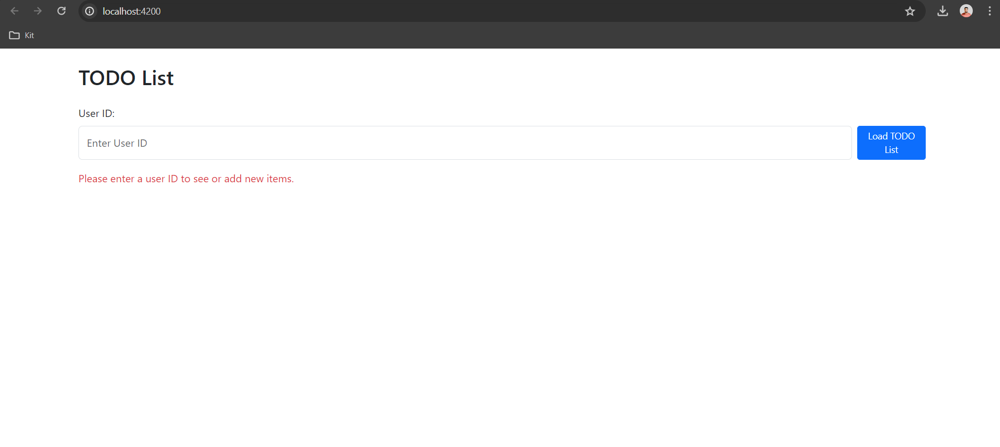

# Angular TODO App

This is a simple Angular application for managing TODO lists.

## Setup Instructions

Follow these steps to set up and run the project locally:

### Prerequisites

Make sure you have the following software installed on your machine:

- Node.js and npm (Node Package Manager): [Download & Install Node.js](https://nodejs.org)

Also make sure to clone,setup and run the WebAPI using below link in your local machine.

- https://github.com/mahekmerchant/TODOWebAPI

#### Installation

1. Clone the repository to your local machine.

  - https://github.com/mahekmerchant/todo-list-app
2. Navigate to the project directory.

  - cd todo-list-app

3. Install project dependencies using npm.

   -npm install
   
##### Running the application
Once you have installed the dependencies, you can run the Angular application using the Angular CLI.

  - ng serve
    
The application will be served at http://localhost:4200/. Open this URL in your web browser to view the application.

   
   
###### Running Unit Tests
You can run the unit tests for the application using the following command:

  - ng test

This will run all the unit tests in the project and provide the test results in the terminal.
